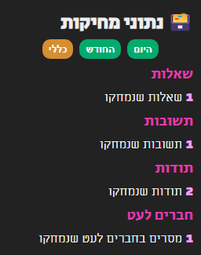

# 🎢 Stips Stats Extension

Counts what you do on [stips](https://stips.co.il), so that you will realize you spend too much time on the platform 🥹

> ~~obvious~~ **NOTE:** The extension only counts events that happen in the browser,
> so if you do actions in your phone it won't count them because
> the extension is not installed there.

## 🪁 Installation

*Very straight forward :)*

 

**
👆 English Explanation
**

1. Download the extension and unzip if needed
2. Open Google Chrome
3. Go to [chrome://extensions](chrome://extensions)
4. Enable **`Developer Mode`** (toggle on the top right)
5. Click on the **`Load Unpacked`** button
6. Select the extension folder
7. Refresh stips and enjoy 😇

 

**
🇮🇱 Hebrew Explanation
**

1. להוריד את התוסף ולחלץ
2. לפתוח כרום
3. ללכת לכתובת [chrome://extensions](chrome://extensions)
4. לאפשר מצב פיתוח בצד שמאל למעלה
5. ללחוץ על: `טעינת פריט Unpacked`
6. לבחור את התיקייה של התוסף
7. לרענן את סטיפס

## 🏹 Features
- [x] 🗑️ Deletions (questions, answers, penfriends, todot)

#### Currently the popup looks like this

## ➕ TODO

- [ ] Log other thing like revisions, penfriends comments, thanks comments, dms... 
- [ ] `+-0.63 (0.61%)` kind of thing (like stocks) in the **Daily** and **Monthly** sections
- [ ] Statistics graphs 